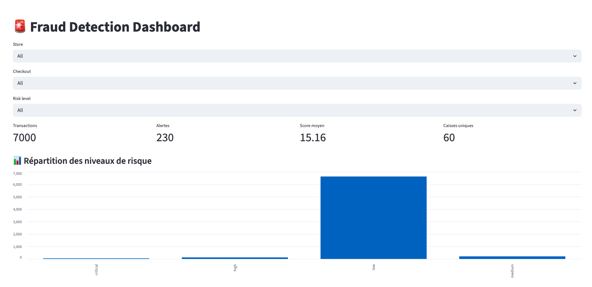
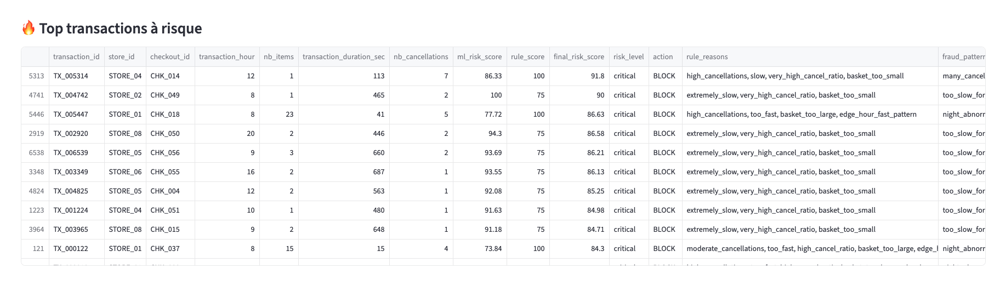
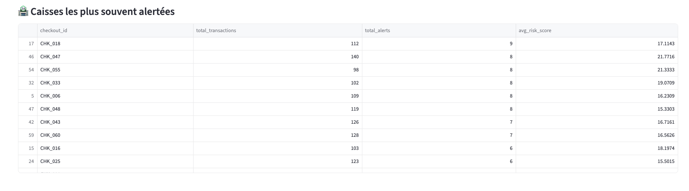

# 🚨 AI Fraud Detection for Retail Self-Checkout

## 📌 Overview

This project implements an AI-powered fraud detection system designed for retail self-checkout environments.

The goal is to detect suspicious transactions based on behavioral patterns such as:
- number of items
- transaction duration
- cancellations
- time of day
- store type
- checkout usage

The system combines machine learning and business logic to generate actionable decisions for store operations.

---

## 🧠 Approach

The solution is built using a hybrid approach:

### 1. Machine Learning (Anomaly Detection)
- Model: Isolation Forest
- Detects abnormal transaction behavior without requiring labeled fraud data

### 2. Feature Engineering
- Time per item
- Cancellation ratio
- Basket vs store average
- Transaction timing (hour, weekday, weekend)
- Store and checkout activity levels

### 3. Business Rules Engine
- High cancellations
- Extremely fast or slow transactions
- Abnormal basket size
- Suspicious edge-hour behavior

### 4. Hybrid Risk Scoring
Final score combines:
- 60% Machine Learning score
- 40% Business rules score

---

## 🚨 Risk Levels & Actions

Each transaction is classified into risk levels:

| Risk Level | Action   |
|------------|----------|
| Low        | OK       |
| Medium     | MONITOR  |
| High       | REVIEW   |
| Critical   | BLOCK    |

This makes the system directly usable by operational teams.

---

## 📊 Results (Simulated Data)

- Recall: ~60%
- Precision: ~92%
- Alert rate: ~3.3%

The system is optimized to balance fraud detection and operational workload.

---

## 🏪 Use Case

Designed for:
- Retail stores 
- Self-checkout systems
- Loss prevention teams
- Payment / transaction monitoring systems

---

## 📊 Dashboard (Streamlit)

An interactive dashboard allows:
- Filtering by store and checkout
- Viewing top risky transactions
- Understanding fraud patterns
- Monitoring risk distribution

Launch it with:

```bash
streamlit run app/streamlit_app.py
=======
# 🚨 AI Fraud Detection for Retail Self-Checkout



---

## 📌 Overview

This project implements an **AI-powered fraud detection system** designed for retail self-checkout environments.

The goal is to detect suspicious transactions based on behavioral patterns such as:

- Number of items  
- Transaction duration  
- Cancellations  
- Time of day  
- Store type  
- Checkout usage  

The system combines **machine learning and business rules** to generate actionable decisions for store operations.

---

## ⚠️ Disclaimer

This project is based on **synthetic data** and does not use any real company or production data.

---

## 🧠 Approach

### 1. Machine Learning (Anomaly Detection)
- Model: Isolation Forest  
- Detects abnormal transaction behavior without labeled fraud data  

### 2. Feature Engineering
- Time per item  
- Cancellation ratio  
- Basket vs store average  
- Transaction timing (hour, weekday, weekend)  
- Store and checkout activity  

### 3. Business Rules Engine
- High cancellations  
- Extremely fast or slow transactions  
- Abnormal basket size  
- Suspicious edge-hour behavior  

### 4. Hybrid Risk Scoring
Final score combines:
- 60% Machine Learning  
- 40% Business rules  

---

## 🚨 Risk Levels & Actions

| Risk Level | Action   |
|------------|----------|
| Low        | OK       |
| Medium     | MONITOR  |
| High       | REVIEW   |
| Critical   | BLOCK    |

👉 Designed for real operational usage.

---

## 📊 Results

- Recall: ~60%  
- Precision: ~92%  
- Alert rate: ~3.3%  

The system is optimized to balance fraud detection and operational workload.

---

## 📊 Dashboard Preview

### 🏠 Overview


### 📈 Risk Distribution


### 🔥 Top Risky Transactions



---

## 🏪 Use Case

Designed for:

- Retail stores with self-checkout systems  
- Loss prevention teams  
- Payment / transaction monitoring systems  

---

## 🚀 Run the project

```bash
python main.py
streamlit run app/streamlit_app.py
>>>>>>> 27684e9 (Add dashboard screenshots and improve README)
